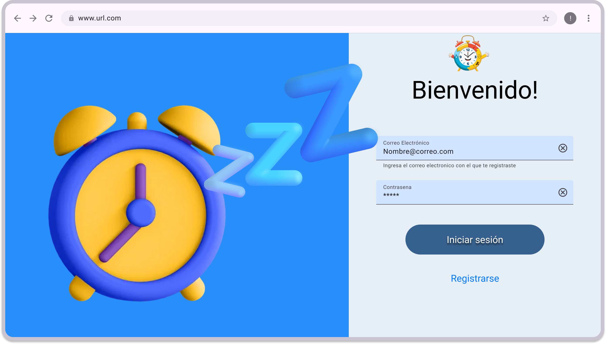

# MISW4302 - Entrega

# Link Mocks WEB

[https://www.figma.com/design/oCGYMQp0hUc0ml0zPa47Yt/Web-wireframe?node-id=0-1&node-type=canvas](https://www.figma.com/design/oCGYMQp0hUc0ml0zPa47Yt/Web-wireframe?node-id=0-1&node-type=canvas)

# Camilo Castro

## PANTALLAS ENTREGADAS




# Hernan Martinez

## PANTALLAS ENTREGADAS


# Ejecutar proyecto

## Requerimientos

- Nodejs 22.2.0
- Angular CLI: 18.2.5
- Package Manager: npm 10.7.0

## Pasos

1. Descargar release del proyecto o clonar el repositorio
2. Ingresar a la carpeta raiz del proyecto
3. Ejecutar el comando

```ocaml
npm install
```

4. Habilitar el modo server de la applicacion 

```ocaml
ng serve -o
```

Nota: En caso de ser necesario, ejecute el siguiente comando y reintente habilitar el modo server de la aplicación:

```ocaml
npm install -g @angular/cli
```


5. Visualizar en el Navegador con la resolucion ***1366 x 768***

6. Seguir el video de Navegacion del proyecto: https://youtu.be/soJnRR4Dy-8
